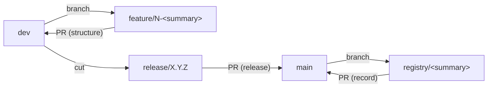

# Contributing

This repo is the SSoT for the registry. `main` is **write-protected** — all
changes land via Pull Request. Branching uses `main` / `dev` / `release/X.Y.Z`
with one shortcut for data: record updates go straight to `main`, while structure
work flows through `dev`. See [*Branching model*](#branching-model).

## Workflow

1. **Open an issue** using the right form:
   - *Registry change request* — add/bind/void/edit records (the only path for
     record changes, including in forks).
   - *Feature* / *Bug* / *Chore* — develop the repo itself: columns, formats,
     docs, templates, or tooling.
2. **Branch off the right base** (see [*Branching model*](#branching-model)):
   record updates branch off `main`; structure work branches off `dev`.
3. **Make the change** and keep [`docs/SCHEMA.md`](docs/SCHEMA.md) accurate.
4. **Open a PR** with the matching template and `Closes #<issue>`: record PRs
   target `main`; structure PRs target `dev`.

## Change types

Two axes. *What* you touch (data vs structure) picks the PR template and its
invariant checklist; *intent* (feature/bug/chore) picks the issue form.

| What changes | Issue form | PR template | PR label |
|--------------|-----------|-------------|----------|
| Records | Registry change request | `registry-update.md` | `record` |
| Structure (schema/docs/templates/tooling) | Feature / Bug / Chore | `schema-change.md` | `schema-change` |

A feature, a bug fix, and a chore on the schema all use `schema-change.md` — they
share the same checklist. The issue form additionally tags intent with
`feature` / `bug` / `chore`.

The issue forms apply their label automatically. PR templates *suggest* the
artifact label (apply it manually, since there is no labeling automation in this
repo yet).

> First-time setup in a fork: create the `record`, `schema-change`,
> `chore`, and `feature` labels once so the issue forms can apply them (`bug`
> ships with every GitHub repo by default).

## Branching model

A `main` / `dev` / `release/X.Y.Z` hierarchy mapped onto the two axes — the
**data axis goes straight to `main`**, the **structure axis flows through `dev`**:

| Branch | Base | Target | Purpose |
|--------|------|--------|---------|
| `main` | — | — | Protected. Production registry + released schema/templates. |
| `dev` | — | `main` (via `release/*`) | Protected integration branch for **structure** work. |
| `release/X.Y.Z` | `dev` | `main` | Cut a versioned schema/template release. Protected. |
| `feature/<issue#>-
` | `dev` | `dev` | New schema/tooling feature. |
| `bugfix/<issue#>-
` | `dev` or `release/X.Y.Z` | same | Structure bug fix. |
| `chore/
` | `dev` | `dev` | Maintenance, no issue required. |
| `registry/
` | `main` | `main` | **Record updates** — straight to `main`, no `dev`. |

**Forks skip `dev` and `release/*` entirely.** A fork is a data store, not a
versioned product: it keeps only `main` plus `registry/
` record
branches that PR directly into `main`. The `dev`/`release` cycle exists only in
the upstream template, where the schema and templates are versioned for forks to
consume.

## Naming conventions

Follows [Conventional Commits](https://www.conventionalcommits.org/), adapted:

- **Commits / PR titles / issue titles**: `type(scope): subject` — imperative,
  lowercase, no trailing period.
  - Types — split by axis (see *Change types* above):
    - **Data axis** (record changes): `record`. One type covers every action
      (mint/bind/retire/void/edit) — the action lives in the subject, not the
      type. Pairs with the `registry` / `print-log` scopes.
    - **Structure axis** (repo development): `feat`, `fix`, `docs`, `chore`,
      `ci`, `refactor`. Pairs with the `schema` / `docs` / `repo` / `templates`
      scopes.
  - Scopes: `registry`, `print-log`, `schema`, `docs`, `repo`, `templates`.
  - Examples: `record(registry): bind 3 sensors in batch B-2026-06-08`,
    `record(print-log): append label print for 23456789ABCDEF`,
    `feat(schema): add labeled column`.
- **Branches** — the prefix is the branch type, **not** the commit type
  (branch `feature/…`, commit `feat(scope): …`). See
  [*Branching model*](#branching-model):
  - Structure: `feature|bugfix/<issue#>-<kebab-summary>` off `dev`
    (e.g. `feature/12-add-labeled-column`); `chore/
` needs no issue.
  - Releases: `release/X.Y.Z` off `dev` (e.g. `release/1.2.0`).
  - Routine data updates: `registry/
` off `main`
    (e.g. `registry/B-2026-06-08-bind`).

## Changelog

[`CHANGELOG.md`](CHANGELOG.md) tracks **structure** changes only — the
development axis (schema, docs, templates, tooling). It uses the
[Keep a Changelog](https://keepachangelog.com/) format with an `## Unreleased`
section.

- **Structure PRs** (`schema-change.md`, targeting `dev`): add an entry under
  `## Unreleased` using the right category (`Added` / `Changed` / `Deprecated` /
  `Removed` / `Fixed` / `Security`) and paste it into the PR's *Changelog Entry*
  section. Skip only pure-internal chores with no user-visible or workflow
  impact (note "No changelog needed" and why). Format:
  `- **Bold title** ([#issue](url))` with indented detail sub-bullets.
- **Record PRs** (`registry-update.md`, targeting `main`) are **exempt** — the
  CSVs and their git history are the data SSoT and `print_log.csv` is already an
  append-only audit log, so a changelog would duplicate them.
- **On `release/X.Y.Z`** the accumulated `## Unreleased` entries are promoted to
  a dated `## [X.Y.Z]` section; don't add new `## Unreleased` items there.
- Never edit entries below `## Unreleased` (released, dated sections).

## Data invariants

When editing the CSVs (by hand or via the app), preserve:

- `registry.csv` **sorted by `id` ascending**.
- `print_log.csv` **append-only** (never edit/delete existing rows).
- Per-status field rules and allowed transitions (`unbound -> bound`,
  `bound -> bound`, `bound -> retired`, `* -> void`; no back-transitions) — see
  `docs/SCHEMA.md`.
- `labeled=yes` only on `bound` or `retired` rows (a sticker only exists on a
  part that is/was bound).
- New columns are appended at the end (forward-compatible).
