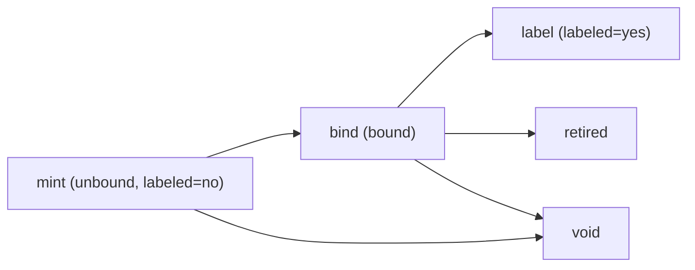

# Part Registry

A minimal, forkable **single source of truth (SSoT)** for a detailed component
registry: per-instance physical parts identified by stable 14-char nano-id IDs,
tracked through a `mint -> (label) -> bind` lifecycle. Data lives as plain CSV so
it stays usable, diffable, and permanent — even without any app.

This is a **GitHub template repository**. Fork it (Use this template) to host
your own registry, then run the one-time
[Fork setup](CONTRIBUTING.md#fork-setup) (delete the seed rows, create labels,
protect `main`, repoint the schema link, enable template sync). Once enabled, the
[`template-sync`](.github/workflows/template-sync.yml) workflow keeps your
instance current by opening a PR whenever upstream cuts a new release — refreshing
the upstream contract mirror and templates, and flagging schema changes for you
to adopt, while leaving your records untouched. The viewer/editor app lives
separately at `vig-os/part-registry-app` (in progress) and is optional.

## What's in here

| File | Purpose |
|------|---------|
| [`registry.csv`](registry.csv) | Canonical part records, sorted by `id`. Ships with a worked example; delete on fork. |
| [`print_log.csv`](print_log.csv) | Append-only label-print audit trail. |
| [`docs/SCHEMA.md`](docs/SCHEMA.md) | Hand-written field/format/lifecycle reference. |
| [`template/`](template/) | Read-only mirror of the upstream contract — schema, worked example CSVs, README, changelog — that the sync tracks. |
| `.github/` | Issue forms, PR templates, and the `template-sync` workflow. |

`registry.csv` / `print_log.csv` ship with illustrative example rows — delete
them after forking (keep the header) and start minting your own. Every column and
format is documented in [`docs/SCHEMA.md`](docs/SCHEMA.md), with a read-only copy
of the example mirrored under [`template/`](template/).

## Data model

- **IDs**: 14-char nano-id over `23456789ABCDEFGHJKMNPQRSTUVWXYZ` (no
  `0 O 1 I L`).
- **`status`**: `unbound` -> `bound`, plus terminal `retired` (was in service,
  now decommissioned/superseded) and `void` (never a valid part: mis-mint,
  scrapped, mistake).
- **`labeled`**: `yes` / `no` — whether a physical sticker is on the part
  (`yes` only when `bound`/`retired`; a bound part may stay unlabeled, e.g. a
  subcomponent or one that already carries its own printed ID).

Full column definitions and per-status rules are in
[`docs/SCHEMA.md`](docs/SCHEMA.md).

## Using it without the app

Edit the CSVs by hand. Keep these invariants (see `docs/SCHEMA.md`):

- `registry.csv` stays **sorted by `id` ascending** (so diffs stay minimal).
- `print_log.csv` is **append-only**.
- Respect per-status field rules and allowed transitions.

## Using it with the app

Once `vig-os/part-registry-app` is published, point it at this repo to read and
to open record-change PRs. The app is a convenience layer; this repo remains the
SSoT.

## Contributing / making changes

`main` is protected. Every change goes through **issue -> branch -> PR**; no
direct pushes. Two flavors:

- **Registry data update** (records) — issue form "Registry change request",
  PR template `registry-update.md`, label `record`. Branches off `main` and
  PRs **straight into `main`**. The only path for record changes, incl. in forks.
- **Structure / development** (columns, formats, docs, templates, tooling) —
  issue form "Feature", "Bug", or "Chore"; PR template `schema-change.md`, label
  `schema-change`. Flows through `dev`, released to `main` via `release/X.Y.Z`.

Branching is `main` / `dev` / `release/X.Y.Z` + topic branches, except record
updates skip `dev`. **Forks keep only `main`** — they do record updates and have
no `dev`/release cycle. See [`CONTRIBUTING.md`](CONTRIBUTING.md) for the
branching model, naming, and commit conventions.

## Status & roadmap

This is the minimal V1: data + docs + issue/PR templates. Deferred, tracked as
issues:

- Validation/CI guardrails (tooling lives in a separate repo).
- A machine-readable contract (defined elsewhere) to generate `docs/SCHEMA.md`.
- `audit_log.csv` (signed, chain-hashed audit trail).
- Branch protection codification and app integration.
